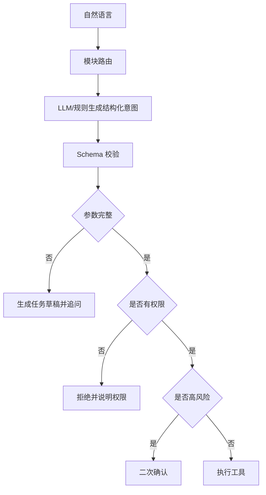

# LLM结构化意图识别与规则兜底

## 技术名称

LLM JSON 结构化意图识别 + 规则兜底

## 为什么需要它

自然语言操作的难点不是调用接口，而是稳定识别“用户想做什么、对象是谁、参数是否足够、是否需要追问”。纯规则容易漏掉表达方式，纯 LLM 又可能幻觉、越权或输出不稳定。更合理的做法是让大模型输出结构化 JSON，再用后端规则、权限和 schema 做校验。

## 本项目中的应用

本项目的意图处理分布在 `app/services/campus_agent/llm_planner.py`、`planner.py`、`planning_graph.py`、`resolver.py`、`intent_router.py` 与 `orchestrator.py`。教务操作会被规划成 `tool_code + args + missing_fields`，再进入解析、补槽、确认和执行链路。

## 实现流程

## 核心实现

核心对象应包含：

- `intent`：用户意图，例如查询、创建、修改、删除、发送。
- `tool_code`：后端工具编码，例如 `query_student`、`send_email`。
- `args`：结构化参数。
- `missing_fields`：缺失字段。
- `confidence`：识别置信度。
- `reason`：简短解释，便于日志排查。

关键代码路径：

- `app/services/campus_agent/planning_graph.py`
- `app/services/campus_agent/resolver.py`
- `app/services/campus_agent/tool_specs.py`
- `app/services/campus_agent/tool_handlers.py`

## 最佳实践

- LLM 输出必须是 JSON，不让它直接执行数据库操作。
- 每个工具都要有参数 schema、权限码、风险级别和确认策略。
- 低置信度时追问，不要强行执行。
- 用户切换模块时，应清理或隔离上一个模块的未完成草稿。
- 规则兜底只处理高频明确表达，不能让规则成为唯一智能来源。

## 面试亮点

可以这样介绍：我没有让大模型直接操作系统，而是让它做结构化意图识别，后端再校验权限、参数和风险。这种方式兼顾自然语言体验和系统安全。

可能追问：为什么还需要规则？

回答：规则用于兜底高频稳定表达和安全校验，LLM 用于泛化理解。两者结合比单独使用更稳定。

## 可以迁移到哪些项目

自然语言数据库、企业 Copilot、客服工单、低代码平台、OA 审批、智能运维。

## 标签

#LLM #IntentRecognition #Prompt #JSONSchema #Agent
