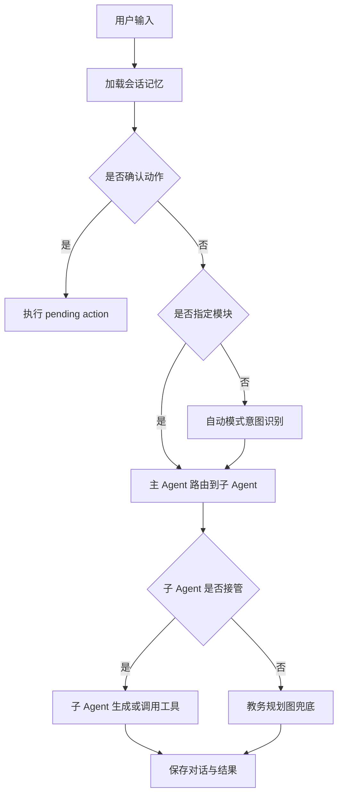

# 主Agent与子Agent编排

## 技术名称

主 Agent 与子 Agent 编排模式

## 为什么需要它

当一个智能助手同时承担教务操作、RAG 问答、搜索、地图、文档处理、情绪陪伴、GitHub 操作等能力时，如果所有逻辑都堆在一个大函数里，会出现意图冲突、模块串话、权限难控和后续扩展困难。主 Agent 与子 Agent 编排的价值，是把“先判断交给谁处理”和“具体怎么处理”分开。

它适合用于综合助手、企业 Copilot、AI 客服、工作流平台和多工具 Agent。

## 本项目中的应用

本项目在 `app/services/campus_agent/orchestrator.py` 中由 `CampusAgentOrchestrator` 作为主入口，构建 `MasterAgentRouter`，再挂载 RAG、搜索、GitHub、编程助手、文档处理、情绪陪伴、学习辅导、地图生活、数据分析、世界杯、AI 知识问答等子 Agent。

这样设计的原因是：前端足球助手虽然是一个入口，但后端不能把所有问题都当教务 CRUD 处理；不同模式应进入不同能力边界，避免“学习问题被当成学生查询”“情绪问题被当成教务操作”。

## 实现流程

## 核心实现

核心文件：

- `app/services/campus_agent/orchestrator.py`：统一入口、模式识别、子 Agent 派发。
- `app/services/campus_agent/sub_agents.py`：主 Agent、子 Agent 上下文与派发协议。
- `app/services/campus_agent/planning_graph.py`：教务操作规划图。
- `app/services/campus_agent/executor.py`：工具执行与权限校验。

关键思想是：LLM 或规则只负责“建议意图”，真正执行必须经过后端工具注册、权限校验和风险控制。

## 最佳实践

- 一个入口可以承载多个能力，但每个能力必须有独立 mode 或子 Agent。
- 主 Agent 不写业务细节，只做路由、记忆加载、确认动作、兜底。
- 子 Agent 应拥有清晰输入输出协议，例如 `SubAgentContext` 和 `AgentResponse`。
- 自动模式要有兜底，但用户手动选择模块时应优先相信用户选择。
- 不要让 RAG、情绪陪伴、教务 CRUD 共用同一个兜底回复模板。

## 面试亮点

可以这样介绍：我把校园助手设计成主 Agent 调度多个子 Agent 的架构，主 Agent 负责会话上下文、模式判断、权限边界和执行链路，子 Agent 负责各自领域能力。这样既能避免模块串话，也方便后续新增模块。

可能追问：为什么不用一个大 Prompt 解决？

回答：一个大 Prompt 在能力少时可行，但模块多后会出现上下文污染、工具误调用和权限边界不清。主子 Agent 编排可以把能力拆开，并让后端掌握最终执行权。

## 可以迁移到哪些项目

AI 客服、企业知识库、校园助手、CRM Copilot、ERP 助手、运维助手、Agent 平台。

## 标签

#Agent #Supervisor #SubAgent #LangGraph #架构模式
