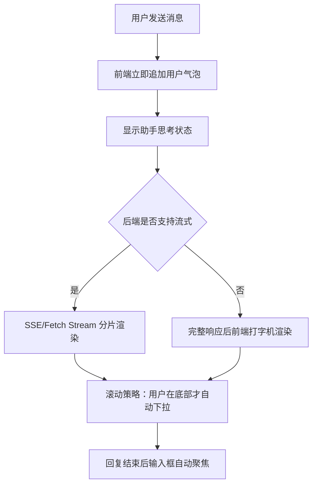

# 流式输出与前端体验

## 技术名称

AI 助手流式输出与对话体验优化

## 为什么需要它

用户和 AI 对话时，如果等完整答案生成后才显示，会感觉卡顿。流式输出能像豆包、通义千问一样逐字或分段出现，降低等待焦虑。即使后端暂未真正 SSE，也可以在前端做打字机式渐进渲染，提升体验。

## 本项目中的应用

本项目足球助手位于 `frontend/src/components/AIAssistant.vue`，负责模块切换、会话历史、文件附件、输入框聚焦、悬浮提示和回答展示。后端统一入口在 `app/api/v1/ai.py` 与 `app/services/campus_agent/orchestrator.py`。

## 实现流程

## 核心实现

关键路径：

- `frontend/src/components/AIAssistant.vue`
- `frontend/src/api/ai.ts`
- `app/services/campus_agent/orchestrator.py`

核心体验点：

- 发送后保留输入焦点。
- 用户回看历史时不强制滚到底。
- 不同模块保留各自上下文。
- 长答案分段显示，避免突然整块出现。

## 最佳实践

- 真流式优先使用 SSE 或 Fetch ReadableStream。
- 前端模拟流式只能改善体验，不能减少真实等待时间。
- 滚动策略要尊重用户：只有用户在底部时自动滚动。
- 错误也要流畅展示，不要让气泡一直停在“思考中”。
- 移动端要控制气泡高度和输入区遮挡。

## 面试亮点

可以这样介绍：我把 AI 对话体验拆成后端生成和前端渲染两层，即使后端不是完全流式，也能通过前端渐进渲染、滚动控制和自动聚焦提升真实使用感。

可能追问：SSE 和 WebSocket 怎么选？

回答：单向模型输出用 SSE 更简单，双向实时协作用 WebSocket 更合适。

## 可以迁移到哪些项目

AI 聊天、客服系统、代码助手、知识库问答、教育辅导平台。

## 标签

#Streaming #FrontendUX #SSE #ChatUI
