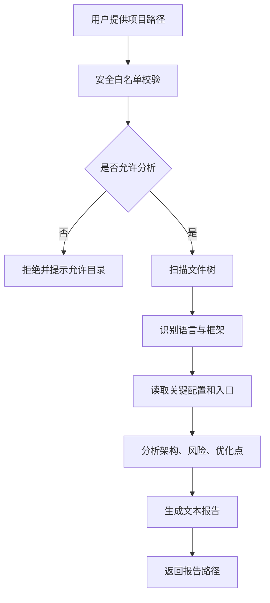

# 编程助手代码分析

## 技术名称

编程助手与代码静态分析

## 为什么需要它

编程助手的价值不是简单聊天，而是能读取项目目录，识别技术栈、模块结构、风险点、可优化方向，并生成可复查的分析报告。它适合用于代码体检、项目交接、学习开源项目和辅助重构。

## 本项目中的应用

本项目在 `app/services/campus_agent/code_analysis_tools.py` 中实现代码分析能力，前端将“代码体检”改名为“编程助手”。用户可以提供本地项目路径，系统在白名单范围内扫描目录、识别技术栈、统计文件、分析结构并生成报告文件。

## 实现流程

## 核心实现

关键路径：

- `app/services/campus_agent/code_analysis_tools.py`
- `app/services/campus_agent/orchestrator.py`
- `frontend/src/components/AIAssistant.vue`

核心分析维度：

- 技术栈识别。
- 目录结构分析。
- 关键配置识别。
- 权限、安全、日志、RAG、Agent 等能力扫描。
- 风险与优化建议输出。

## 最佳实践

- 本地路径分析必须有白名单，不能任意读全盘。
- 分析报告要落盘，方便反复查看。
- 代码分析应优先读配置、入口、路由、模型和服务层。
- 不要把业务代码逐行复述，应抽取架构和工程问题。
- 后续接入 LLM 时，应先做静态结构提取，再让模型总结，减少幻觉。

## 面试亮点

可以这样介绍：编程助手先做安全路径校验，再扫描项目结构和关键文件，最后生成代码体检报告。它不是简单问答，而是把静态分析和 AI 总结结合起来。

可能追问：如何避免读取敏感文件？

回答：用路径白名单、忽略 `.env`、密钥、node_modules、venv 等目录，并限制文件大小。

## 可以迁移到哪些项目

代码审查平台、开源学习助手、DevOps 平台、研发知识库、项目交接工具。

## 标签

#CodeAnalysis #ProgrammingAssistant #StaticAnalysis #AIEngineering
