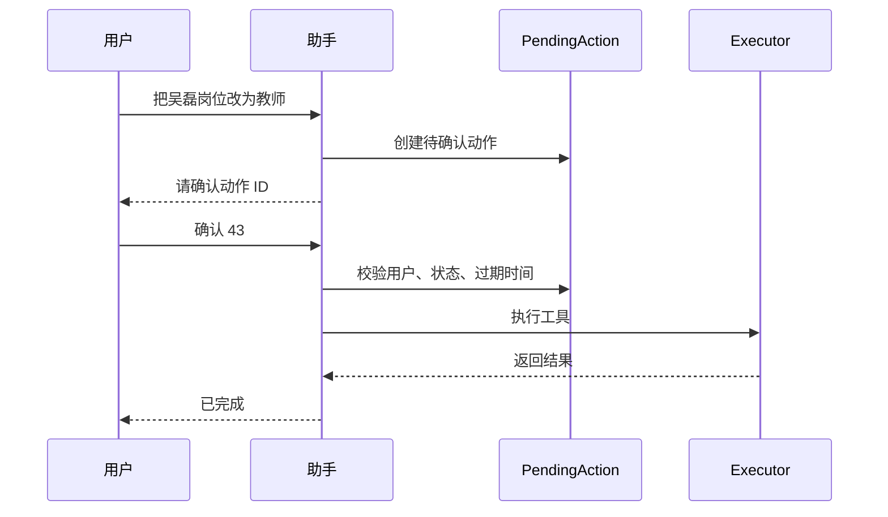

# 高风险操作二次确认

## 技术名称

高风险工具操作二次确认

## 为什么需要它

自然语言操作会带来误识别风险。删除、修改、群发邮件、提交申请等操作一旦误执行，会影响真实数据。因此高风险操作不能“听懂就执行”，必须先生成待确认动作，用户明确确认后再执行。

## 本项目中的应用

本项目在 `app/services/campus_agent/registry.py` 为每个工具定义 `risk` 与 `confirm_required`，在 `app/services/campus_agent/pending_actions.py` 里保存待确认动作，默认 10 分钟过期。用户回复“确认 43”后，`orchestrator.py` 会解析确认编号并执行对应动作。

## 实现流程

## 核心实现

核心文件：

- `app/services/campus_agent/pending_actions.py`
- `app/models/agent.py`
- `app/services/campus_agent/orchestrator.py`
- `app/services/campus_agent/executor.py`

关键字段包括 `user_id`、`session_id`、`tool_code`、`args_json`、`risk`、`status`、`expires_at`、`executed_at`。

## 最佳实践

- 中高风险操作必须二次确认。
- 确认动作必须绑定用户，不能跨用户执行。
- 确认动作要有过期时间。
- 确认时再次校验权限，避免用户角色变化后仍能执行。
- 回复中应清楚展示变更前后，而不是只给一个按钮。

## 面试亮点

可以这样介绍：自然语言操作不是简单 CRUD，我对写操作做了 pending action 机制，高风险动作先入库，用户确认后才执行，且确认时仍会校验用户、权限和过期时间。

可能追问：为什么不直接前端弹窗？

回答：前端弹窗只是交互层，安全边界必须在后端。后端 pending action 能防止接口绕过和多端误操作。

## 可以迁移到哪些项目

财务系统、审批系统、CRM、ERP、智能客服、运维平台、邮件群发系统。

## 标签

#Agent #安全设计 #二次确认 #Audit
