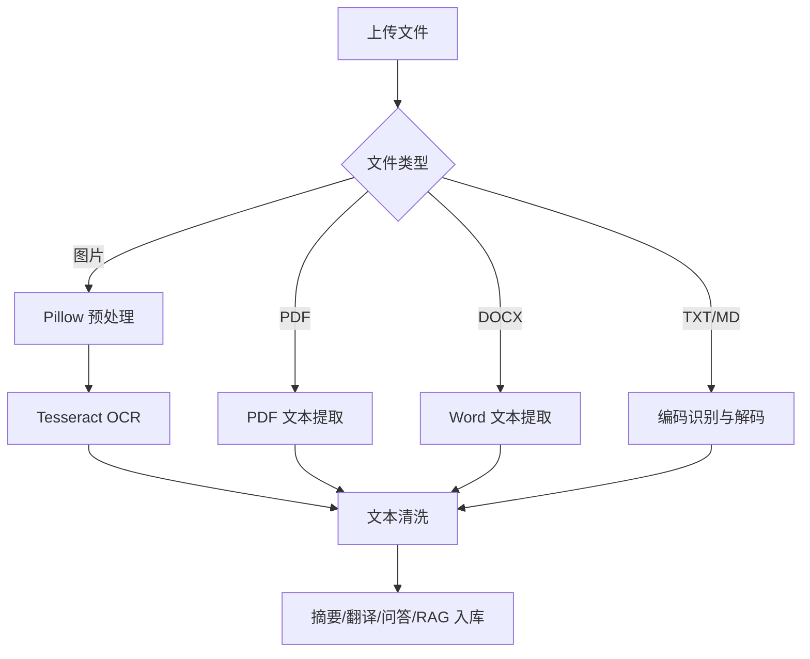

# OCR与文档解析

## 技术名称

OCR 图片文字识别与多格式文档解析

## 为什么需要它

用户上传的资料可能是图片、PDF、Word、Markdown 或纯文本。文档智能模块必须先把非结构化文件转成可处理文本，再进行摘要、翻译、问答或入库。OCR 用于解决图片中的文字提取问题。

## 本项目中的应用

本项目在 `app/services/ocr_service.py` 中封装 Tesseract OCR，自动寻找 Windows 常见安装路径，支持 `TESSERACT_CMD` 和项目内 `tools/tessdata`。`app/services/document_parser.py` 和 `app/services/campus_agent/document_tools.py` 负责文档解析与助手入口。

## 实现流程

## 核心实现

关键路径：

- `app/services/ocr_service.py`
- `app/services/document_parser.py`
- `app/services/campus_agent/document_tools.py`

OCR 关键处理：

- 检测 `chi_sim+eng` 语言包。
- 小图放大，提高识别率。
- 灰度化与自动对比度增强。
- 使用 `--psm 6` 处理常见整块文本图片。

## 最佳实践

- OCR 引擎和 Python 包不是一回事，部署时都要检查。
- 中文 OCR 必须确认 `chi_sim.traineddata` 可用。
- 对截图、扫描件先做灰度、放大、对比度增强。
- PDF 既可能有文本层，也可能是扫描图，正式系统应两条路径都支持。
- 文档解析结果要保留原文件、页码或段落位置，便于追溯。

## 面试亮点

可以这样介绍：我的文档处理不是只读 txt，而是按文件类型分流，图片走 OCR，PDF/DOCX 走解析器，最终统一成文本，再接摘要、翻译或 RAG。

可能追问：OCR 准确率低怎么办？

回答：可以做图像预处理、语言包优化、版面分析、人工校对，也可以换 PaddleOCR 等更强中文 OCR。

## 可以迁移到哪些项目

档案系统、知识库、合同审阅、票据识别、作业批改、资料问答。

## 标签

#OCR #DocumentAI #Tesseract #Pillow #RAG
