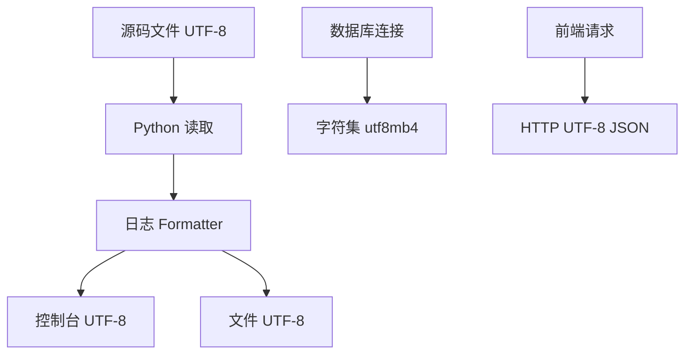

# 中文编码与乱码治理

## 技术名称

中文编码与乱码治理

## 为什么需要它

Windows、PowerShell、Python、数据库和前端之间编码不一致时，中文日志、注释、启动信息和错误提示容易出现乱码。乱码不仅影响体验，也会影响日志排查和验收展示。

## 本项目中的应用

本项目在 `main.py` 中通过 `configure_console_encoding` 设置 Windows 控制台为 UTF-8，在 `app/core/logging_config.py` 中对 stdout/stderr 做 UTF-8 reconfigure，并让文件日志使用 `encoding="utf-8"`。项目中仍可看到部分历史乱码字符串，这说明编码治理需要从写入、读取、终端和文件保存全链路处理。

## 实现流程

## 核心实现

关键路径：

- `main.py`
- `app/core/logging_config.py`
- `.env` 与数据库连接配置。

治理重点：

- 源码统一 UTF-8。
- 日志文件显式 UTF-8。
- Windows 控制台设置 code page 65001。
- 数据库使用 utf8mb4。
- 历史乱码要回源修复，不能二次复制。

## 最佳实践

- 新项目从第一天统一 UTF-8。
- PowerShell 输出中文时检查 `$OutputEncoding`。
- Python 日志文件必须写 `encoding="utf-8"`。
- 不要把乱码文本当正常字符串继续提交。
- 发现乱码要定位原始正确文本，而不是靠猜测替换。

## 面试亮点

可以这样介绍：我在项目中处理了 Windows 控制台、Python 日志和文件输出的 UTF-8 配置，解决中文项目常见的启动日志乱码和排障困难问题。

可能追问：为什么设置了 UTF-8 仍有乱码？

回答：如果源码或历史数据已经以错误编码保存，运行时设置只能防止新输出乱码，旧内容需要回源修复。

## 可以迁移到哪些项目

中文后台系统、教育系统、政务系统、Windows 部署项目、日志平台。

## 标签

#Encoding #UTF8 #Windows #日志 #工程实践
