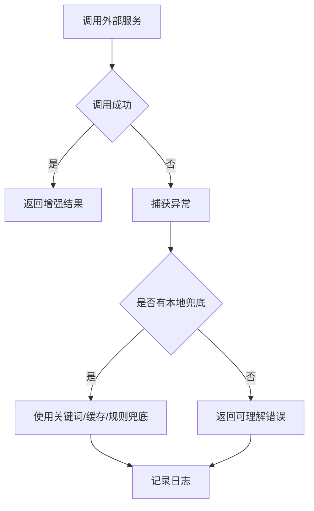

# 外部工具降级策略

## 技术名称

外部 AI 工具和第三方服务降级策略

## 为什么需要它

AI 系统常依赖 Tavily、地图 API、GitHub、Milvus、OCR、Ollama 或在线大模型。任何一个服务不可用，都不应拖垮整个系统。降级策略能保证核心系统继续可用，并向用户说明当前能力边界。

## 本项目中的应用

本项目在多个服务中都有降级思想：RAG 的 Milvus 搜索失败会退回关键词候选；搜索工具失败会返回可读错误；Redis 异常不阻塞登录；OCR 缺依赖会提示安装；GitHub 网络异常会返回原因。

## 实现流程

## 核心实现

关键路径：

- `app/services/rag_knowledge_service.py`
- `app/services/campus_agent/web_search_tools.py`
- `app/services/campus_agent/map_tools.py`
- `app/services/campus_agent/github_tools.py`
- `app/redis.py`
- `app/services/ocr_service.py`

## 最佳实践

- 外部服务调用必须设置超时。
- 错误消息要面向用户可理解，同时日志保留技术细节。
- 能本地兜底就本地兜底，例如 Milvus 不可用时用关键词检索。
- 不要因为 Redis、搜索或 OCR 失败影响系统登录和基础教务功能。
- 关键 API Key 读取失败时要在启动或健康检查中提示。

## 面试亮点

可以这样介绍：项目里所有外部增强能力都不是硬依赖，失败时会降级到本地能力或给出明确提示，避免一个第三方服务故障导致整个助手不可用。

可能追问：降级会不会影响准确性？

回答：会影响增强能力质量，但比直接失败更可接受；同时应在回复中说明降级状态，避免用户误解。

## 可以迁移到哪些项目

AI 平台、微服务系统、搜索系统、地图应用、企业知识库、SaaS 后台。

## 标签

#Fallback #Reliability #AIEngineering #外部服务
