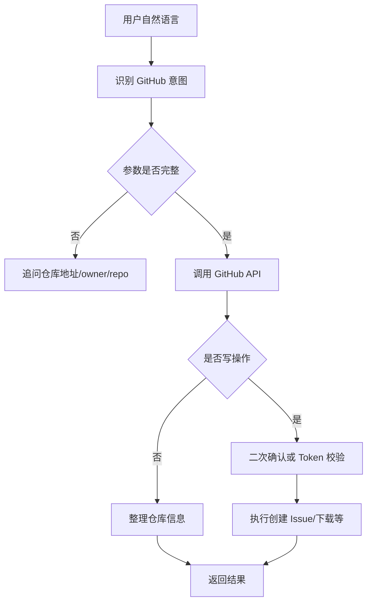

# GitHub自然语言工具

## 技术名称

GitHub 自然语言工具调用

## 为什么需要它

开发类助手需要能查询仓库、Issue、代码目录，甚至下载公开仓库用于学习和演示。用户不应记住 GitHub API 参数，而是用自然语言表达“下载这个仓库”“创建 issue”“看 open issue”。

## 本项目中的应用

本项目在 `app/services/campus_agent/github_tools.py` 中封装 GitHub 能力，足球助手的 GitHub 模块通过自然语言触发仓库查询、Issue 操作和公开仓库下载等动作。

## 实现流程

## 核心实现

关键路径：

- `app/services/campus_agent/github_tools.py`
- `app/services/campus_agent/orchestrator.py`

核心能力：

- 根据 URL 或 owner/repo 解析仓库。
- 查询仓库描述、语言、Stars、默认分支和根目录。
- 创建 Issue 需要 Token。
- 下载公开仓库适合演示小型项目。

## 最佳实践

- Token 不应写死在代码里，应放 `.env` 并限制权限。
- 下载大型仓库前要提示体积和耗时。
- 写操作必须二次确认。
- 网络失败要区分 SSL、认证、限流和仓库不存在。
- 公开代码下载目录要限制在安全白名单内。

## 面试亮点

可以这样介绍：GitHub 助手把自然语言转为 GitHub API 调用，读操作可以直接执行，写操作需要 Token 和确认，既能演示代码获取，也能扩展到研发工作流。

可能追问：fine-grained token 为什么更好？

回答：它可以只授权某个仓库和必要权限，风险远低于全账户 classic token。

## 可以迁移到哪些项目

研发助手、代码学习平台、开源情报系统、DevOps 平台、项目管理助手。

## 标签

#GitHub #ToolCalling #DeveloperAI #API
