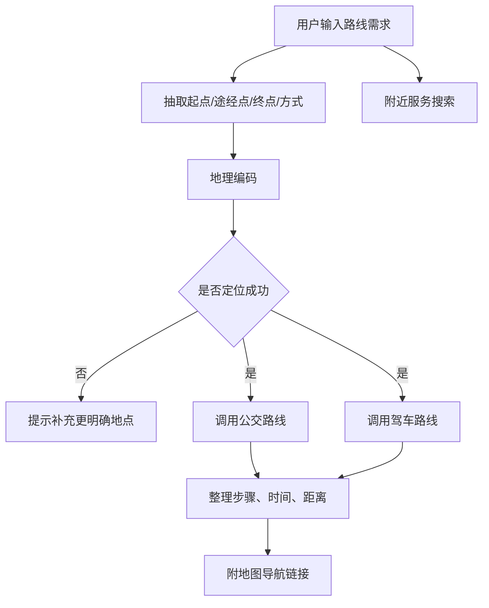

# 地图路线规划工具

## 技术名称

地图路线规划与生活服务工具

## 为什么需要它

生活类助手需要理解地点、路线、中途点、交通方式和周边服务。它不是普通问答，而是外部地理服务调用：地理编码、路线规划、POI 搜索和地图链接生成。

## 本项目中的应用

本项目在 `app/services/campus_agent/map_tools.py` 中封装高德地图服务，支持地点解析、公交/驾车规划、途经点、附近吃喝玩乐搜索，并由足球助手“路线生活”模块调用。

## 实现流程

## 核心实现

关键路径：

- `app/services/campus_agent/map_tools.py`
- `app/services/campus_agent/orchestrator.py`
- `frontend/src/utils/geolocation.ts`

核心能力：

- Geocode：地点转经纬度。
- Direction：公交、驾车路线。
- POI：附近餐饮、娱乐、生活服务。
- URI：生成可打开的地图链接。

## 最佳实践

- 地点解析失败时不要硬编路线，应要求用户补充城市或地标。
- 同时给公共交通和驾车方案，满足不同用户。
- 输出中要包含距离、耗时、换乘、步行距离等关键信息。
- 地图 API Key 要放后端配置，不要暴露敏感服务端 Key。
- 前端如果能嵌入地图组件，体验会明显好于纯文字。

## 面试亮点

可以这样介绍：路线生活模块不是让大模型凭空描述路线，而是把地点解析和路线规划交给地图服务，模型只负责理解用户需求和组织结果。

可能追问：为什么地图服务容易失败？

回答：常见原因是地点歧义、城市缺失、公交接口不支持跨城或服务商无结果，所以需要地理编码校验和降级方案。

## 可以迁移到哪些项目

校园助手、旅游助手、本地生活、外勤系统、配送系统、门店导流。

## 标签

#Map #AMap #MCP #外部工具 #路线规划
