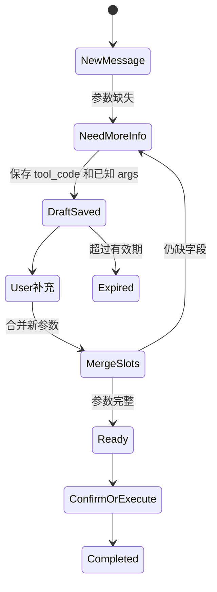

# 短期记忆与任务草稿

## 技术名称

短期记忆与多轮任务草稿

## 为什么需要它

用户自然语言操作通常不是一次说完整。例如“我想请假”“明天上午病假，原因发烧”“确认”。如果系统每轮都从零理解，就会显得不连贯。短期记忆和任务草稿用于保存当前会话的上下文、上一轮工具、缺失字段和候选对象。

## 本项目中的应用

本项目通过 `app/services/campus_agent/memory.py` 读取最近消息，通过 `task_drafts.py` 保存未完成任务。`AgentTaskDraft` 默认 30 分钟过期，支持补槽、追问和继续执行。

## 实现流程

## 核心实现

关键路径：

- `app/services/campus_agent/task_drafts.py`
- `app/services/campus_agent/memory_service.py`
- `app/models/agent.py`
- `app/services/campus_agent/resolver.py`

草稿中保存 `tool_code`、`args_json`、`missing_fields_json`、`candidates_json`、`session_id`、`expires_at`。

## 最佳实践

- 草稿必须按用户和会话隔离。
- 切换模块时应取消或隔离旧草稿，防止 RAG 问题被教务草稿吞掉。
- 缺字段追问要明确告诉用户缺什么。
- 只保留任务必要信息，不要把全部聊天记录塞进草稿。
- 短期记忆要有过期策略，避免历史意图污染当前对话。

## 面试亮点

可以这样介绍：我为自然语言操作设计了任务草稿机制，缺参数时不会失败，而是保存当前意图并引导用户补充；用户补齐后继续同一个任务。

可能追问：短期记忆和长期记忆区别？

回答：短期记忆服务当前任务和当前会话，强调时效；长期记忆保存用户偏好、历史事件和可复用事实，强调跨会话复用。

## 可以迁移到哪些项目

表单助手、审批助手、智能客服、订单系统、问卷系统、CRM Copilot。

## 标签

#Memory #SlotFilling #多轮对话 #Agent
