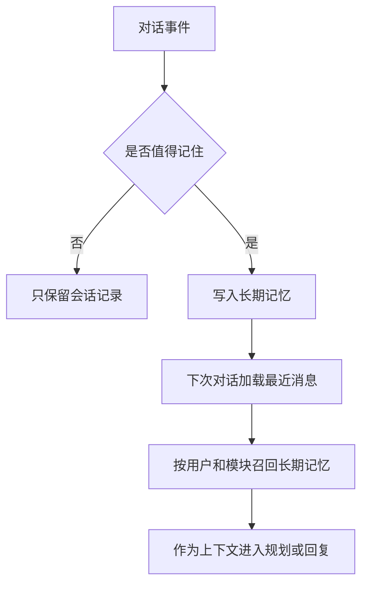

# 长期记忆设计

## 技术名称

Agent 长期记忆

## 为什么需要它

长期记忆用于让助手跨会话记住用户偏好、常用实体、重要事件和历史上下文。没有长期记忆的助手每次登录都像新用户，无法形成个性化体验。

## 本项目中的应用

本项目在 `app/services/campus_agent/memory_service.py` 中提供 `recall_long_term` 和 `remember_event`，模型为 `AgentLongTermMemory`。当前实现以 MySQL 存储为主，按用户、模块、关键词、重要性和更新时间召回；后续可以平滑升级为 Milvus 向量召回。

## 实现流程

## 核心实现

关键路径：

- `app/services/campus_agent/memory_service.py`
- `app/models/agent.py`
- `app/models/conversation.py`

核心字段包括 `user_id`、`module_code`、`memory_type`、`content`、`payload_json`、`importance`、`status`、`last_used_at`。

## 最佳实践

- 长期记忆要按模块隔离，避免情绪记忆污染教务操作。
- 记忆需要重要性评分和状态字段，支持降权、停用和删除。
- 不要记敏感隐私原文，必要时做摘要或脱敏。
- 初期可以关键词召回，数据量增加后再接向量库。
- 记忆写入必须可解释，避免用户不知道系统记住了什么。

## 面试亮点

可以这样介绍：我把助手记忆分为短期任务草稿和长期用户记忆。长期记忆按用户与模块隔离，支持重要性排序和后续向量化扩展，避免简单把所有历史消息塞进 Prompt。

可能追问：为什么不直接传全部聊天记录？

回答：全部历史会导致上下文膨胀、隐私风险和无关干扰。长期记忆应该抽取可复用事实，再按相关性召回。

## 可以迁移到哪些项目

个人助手、AI 客服、学习助手、心理陪伴、CRM、销售助手。

## 标签

#Memory #LongTermMemory #Personalization #Milvus
