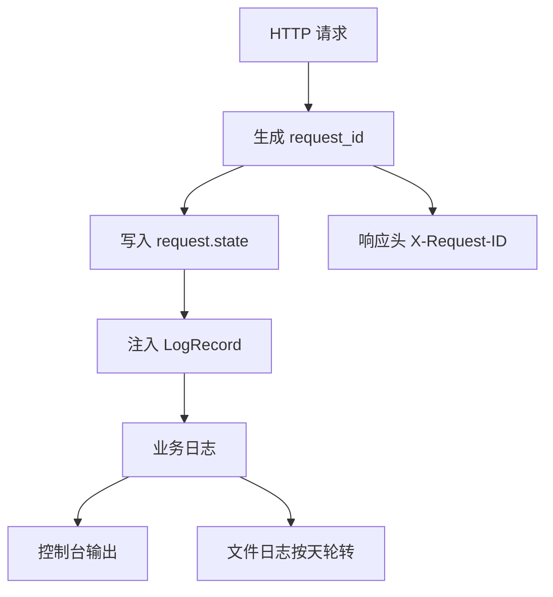

# 日志与请求追踪

## 技术名称

日志轮转与 Request ID 请求追踪

## 为什么需要它

系统出现 502、权限异常、AI 工具失败或 OCR 失败时，需要能从日志定位问题。Request ID 可以把同一次请求中的多条日志串起来，日志轮转可以避免日志文件无限增长。

## 本项目中的应用

本项目在 `app/core/logging_config.py` 中配置控制台和文件日志，使用 `TimedRotatingFileHandler` 按天轮转。`main.py` 中的 `RequestIDMiddleware` 为每次请求生成 `X-Request-ID` 并注入日志记录。

## 实现流程

## 核心实现

关键路径：

- `app/core/logging_config.py`
- `main.py`

日志格式包含时间、级别、模块、request_id 和消息。Windows 控制台通过 `configure_console_encoding` 尝试设置 UTF-8，减少中文乱码。

## 最佳实践

- 每个请求都应有 request_id。
- 异常响应中可返回 request_id，方便用户反馈。
- 日志要按天轮转并设置保留天数。
- 不要在日志中记录明文密码、Token、完整隐私内容。
- AI 工具调用要记录 provider、耗时、错误类型和降级路径。

## 面试亮点

可以这样介绍：系统加入了请求级追踪，所有日志都带 request_id，排查前后端错误时可以用响应头定位后端日志。

可能追问：为什么需要日志轮转？

回答：长期运行系统日志会持续增长，轮转和保留天数能控制磁盘占用并方便按日期排障。

## 可以迁移到哪些项目

所有 Web 后端、微服务、AI 工具平台、网关服务、后台管理系统。

## 标签

#Observability #Logging #RequestID #FastAPI
