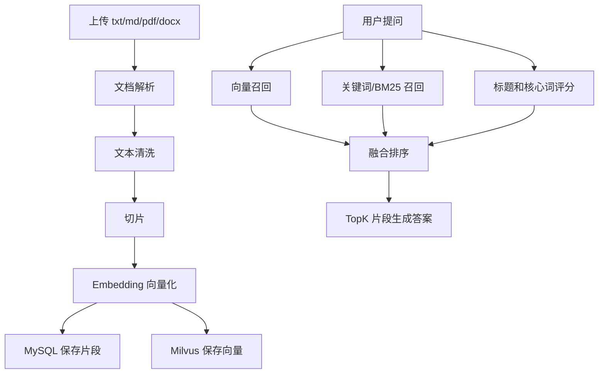

# 混合检索知识库

## 技术名称

RAG 混合检索知识库

## 为什么需要它

RAG 用于让助手基于用户上传资料回答问题，减少模型幻觉。单纯向量检索擅长语义相似，但可能漏掉专有名词；单纯关键词检索精确但不够泛化。混合检索把向量、关键词、标题和核心词命中结合起来，更适合文档问答。

## 本项目中的应用

本项目的综合知识库由 `app/services/rag_knowledge_service.py` 实现，文档切片存 MySQL，向量可进入 Milvus，查询时组合 vector、BM25、title、core token 分数。前端 `frontend/src/views/rag/KnowledgeBase.vue` 展示构建流程、参数和评估信息。

## 实现流程



## 核心实现

关键路径：

- `app/services/rag_knowledge_service.py`
- `app/services/rag_knowledge_milvus.py`
- `app/services/milvus_client.py`
- `app/services/embedding_service.py`
- `app/models/rag_knowledge.py`

核心评分思路：

```text
final_score = vector_score * vector_weight
            + bm25_score * bm25_weight
            + title_score * title_weight
            + core_score * core_weight
```

## 最佳实践

- 文档入库要保留来源、页码、片段号，便于追溯。
- 中文长文要避免切片过短，否则上下文断裂。
- TopK 不宜过大，否则生成答案会被噪声干扰。
- 支持最小相似度阈值，让用户能控制召回严格程度。
- RAG 回答应总结而不是大段复制原文。

## 面试亮点

可以这样介绍：我的 RAG 不是只做向量搜索，而是把 Milvus 向量召回、关键词召回、标题命中和核心词命中融合排序，提高专有名词和语义问题的覆盖。

可能追问：为什么需要混合检索？

回答：向量检索容易语义相近但事实不准，关键词检索容易漏掉同义表达。混合检索能兼顾召回率和精确率。

## 可以迁移到哪些项目

企业知识库、AI 客服、文档问答、法律问答、论文助手、产品手册助手。

## 标签

#RAG #Milvus #Embedding #HybridSearch #BM25
