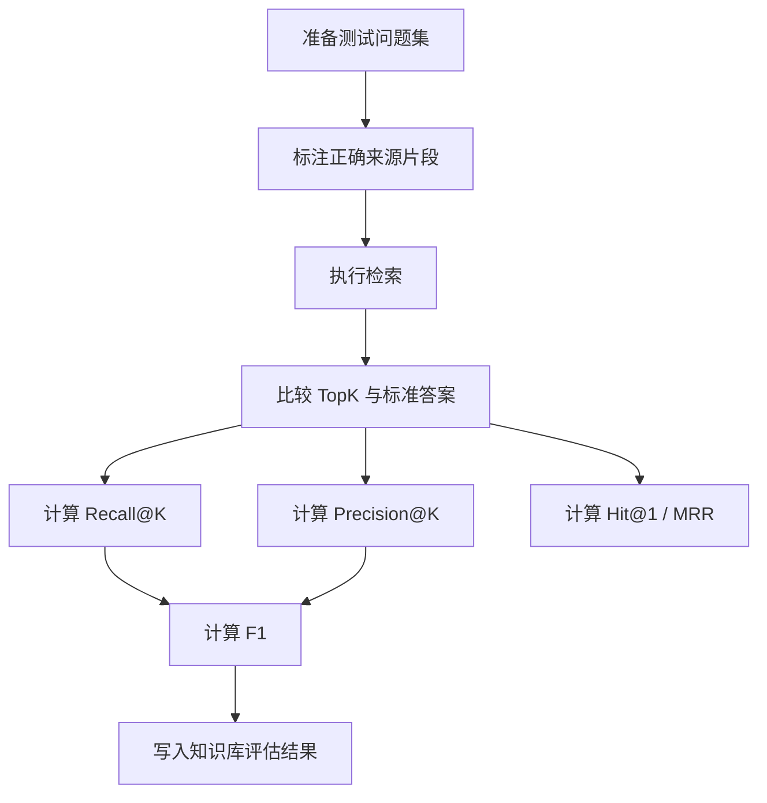

# 知识库评估指标

## 技术名称

RAG 知识库召回率、精确率与 F1 评估

## 为什么需要它

RAG 系统不能只说“能回答”，还要评估检索质量。召回率代表相关资料有没有找回来，精确率代表找回来的资料有多少是真相关，F1 用于综合衡量两者。没有指标，知识库效果只能靠主观感觉。

## 本项目中的应用

本项目在知识库详情中维护 `eval_score`、`eval_recall`、`eval_precision`、`eval_f1`、`eval_hit`、`eval_mrr`、`eval_sample_count` 等字段，并在 `rag_knowledge_service.py` 的 `kb_detail` 中返回给前端展示。

## 实现流程

## 核心实现

核心指标：

- `Recall@K = 命中的相关片段数 / 全部相关片段数`
- `Precision@K = 命中的相关片段数 / TopK 返回片段数`
- `F1 = 2 * Precision * Recall / (Precision + Recall)`
- `Hit@1`：第一条是否命中。
- `MRR`：第一个正确结果排名的倒数。

关键路径：

- `app/models/rag_knowledge.py`
- `app/services/rag_knowledge_service.py`
- `frontend/src/views/rag/KnowledgeBase.vue`

## 最佳实践

- 演示系统可以先用自动抽样和关键词命中，正式系统应引入人工标注测试集。
- 每个知识库都应展示评估时间和样本数量。
- 指标要按知识库独立计算，不能全局混在一起。
- 调整切片、TopK、相似度阈值后要重新评估。
- 评估结果只说明检索质量，不等于最终生成答案完全正确。

## 面试亮点

可以这样介绍：我没有把 RAG 当黑盒，而是引入 Recall、Precision、F1、Hit@1 和 MRR 指标，用户能看到知识库质量，开发者也能据此调参。

可能追问：如何提高召回率？

回答：可以增大 TopK、降低阈值、优化切片、加入关键词召回和查询改写，但要关注精确率下降。

## 可以迁移到哪些项目

企业知识库、搜索系统、问答系统、客服系统、文档审阅平台。

## 标签

#RAG #Evaluation #Recall #Precision #F1
