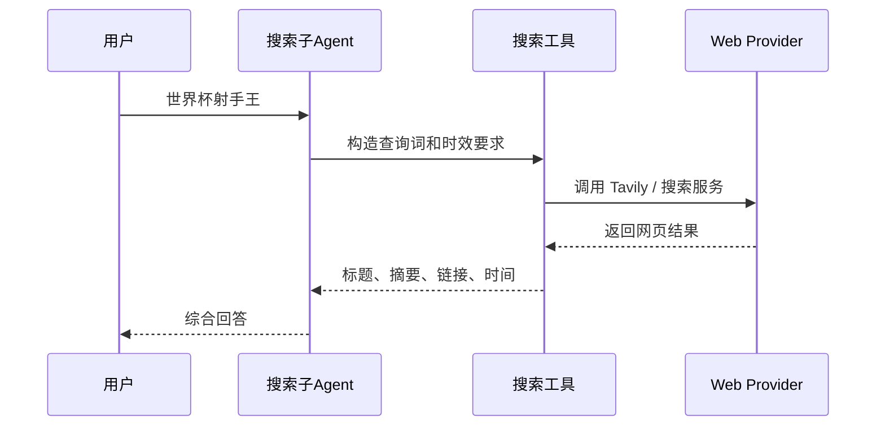

# 搜索引擎与MCP服务

## 技术名称

搜索引擎工具与 MCP 服务化封装

## 为什么需要它

大模型自身知识可能过时，世界杯射手榜、政策新闻、工具版本等都需要实时搜索。把搜索能力封装成工具或 MCP 服务，可以让助手在需要最新信息时调用外部搜索，而不是凭旧知识回答。

## 本项目中的应用

本项目在 `app/services/campus_agent/web_search_tools.py` 中封装 Tavily 搜索，并提供 `search_mcp_server.py` 作为服务化入口。足球助手的搜索引擎模块会优先走搜索工具，再整理成用户可读答案。

## 实现流程

## 核心实现

关键路径：

- `app/services/campus_agent/web_search_tools.py`
- `search_mcp_server.py`
- `app/services/campus_agent/orchestrator.py`

核心策略：

- 有 API Key 时调用 Tavily。
- 搜索结果进入助手总结。
- 面向普通用户时弱化链接堆砌，保留必要来源。

## 最佳实践

- 最新问题必须走搜索，不要用模型静态知识硬答。
- 搜索结果要比较日期和来源可信度。
- 对用户展示时不要堆太多链接，除非用户明确要求。
- 搜索工具应限流、记录错误并提供降级提示。
- 搜索能力适合做成 MCP，方便未来被多个 Agent 调用。

## 面试亮点

可以这样介绍：我把搜索引擎封装成工具层，助手判断问题具有时效性时调用搜索，再由大模型整理答案，解决模型知识过期问题。

可能追问：MCP 的价值是什么？

回答：MCP 把外部能力标准化成工具服务，让不同 Agent 用统一协议调用搜索、地图、文件等能力，便于扩展和隔离。

## 可以迁移到哪些项目

新闻助手、投研助手、竞品分析、知识库补全、AI 浏览器、客服机器人。

## 标签

#MCP #Search #Tavily #实时信息 #Tool
