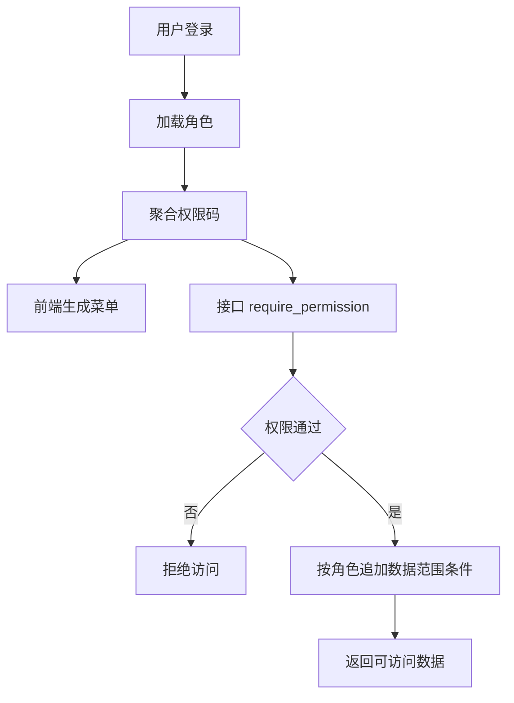

# RBAC与数据范围控制

## 技术名称

RBAC 角色权限与数据范围控制

## 为什么需要它

后台系统不仅要控制“能不能访问某个功能”，还要控制“能看到哪些数据”。学生只能看自己，教师看自己任课或管理范围，院系主任看本院系，管理员看全局。

## 本项目中的应用

本项目通过 `app/core/permissions.py` 获取用户权限码，通过 `require_permission` 在接口层控制访问，通过前端 `frontend/src/utils/permission.ts` 与路由 meta 控制菜单展示。部分业务接口如成绩、考勤、请假还会按角色做数据范围过滤。

## 实现流程

## 核心实现

关键路径：

- `app/core/permissions.py`
- `app/deps.py`
- `app/api/v1/*`
- `frontend/src/router/index.ts`
- `frontend/src/utils/permission.ts`

## 最佳实践

- 功能权限和数据权限要分开考虑。
- 前端隐藏菜单只是体验，后端必须鉴权。
- 导出接口比查询接口风险更高，应单独拆权限。
- 管理员可全局访问，但普通角色必须有边界。
- AI 助手调用工具也必须复用同一套 RBAC。

## 面试亮点

可以这样介绍：系统采用 RBAC 控制功能入口，同时在业务查询中叠加数据范围过滤。AI 助手也复用这套权限，而不是另开后门。

可能追问：学生为什么不能导出教师列表？

回答：导出属于高风险数据能力，应有独立 `operations:export:teachers` 权限，普通学生不应拥有。

## 可以迁移到哪些项目

后台管理、OA、CRM、ERP、教务系统、医疗系统、金融系统。

## 标签

#RBAC #DataScope #权限设计 #安全
