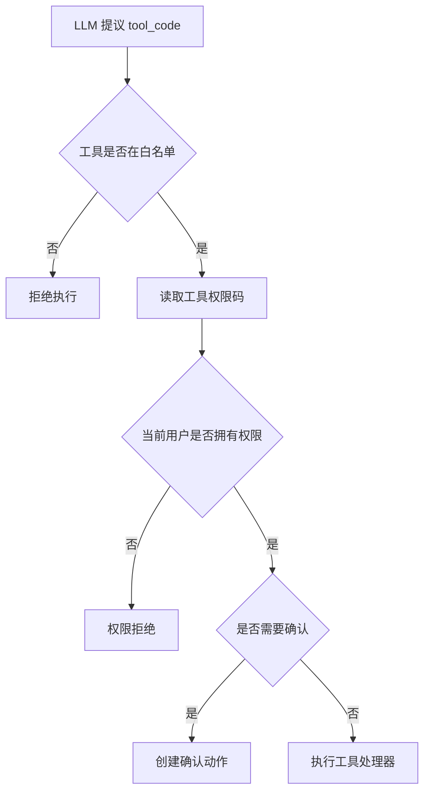

# 工具白名单与权限边界

## 技术名称

Agent 工具白名单与 RBAC 权限边界

## 为什么需要它

AI 助手如果能调用系统接口，就必须防止越权。不能因为用户输入“删除所有学生”，模型就绕过原系统权限直接执行。工具白名单的作用是明确“助手最多能做什么”；RBAC 的作用是明确“当前用户能做什么”。

## 本项目中的应用

`app/services/campus_agent/registry.py` 中的 `AGENT_TOOLS` 是助手工具白名单，每个工具绑定 `permission`、`risk`、`action` 和 `confirm_required`。`app/core/permissions.py` 与 `app/deps.py` 提供角色权限判断，`executor.py` 执行前再次调用 `has_permission`。

## 实现流程

## 核心实现

关键路径：

- `app/services/campus_agent/registry.py`
- `app/services/campus_agent/executor.py`
- `app/core/permissions.py`
- `app/deps.py`
- `frontend/src/utils/permission.ts`
- `frontend/src/router/index.ts`

后端权限是最终边界，前端 `v-permission` 与路由 meta 只负责体验和隐藏入口。

## 最佳实践

- AI 不能直接拼 SQL 或直接访问任意接口。
- 所有可执行能力必须注册到工具白名单。
- 权限校验必须在后端执行器里完成。
- 前端隐藏按钮不能替代后端鉴权。
- 管理员可以有 `*` 权限，但普通角色必须按数据范围和操作类型拆分。

## 面试亮点

可以这样介绍：我的 Agent 不是“模型想调什么就调什么”，而是所有工具都经过注册表、权限码、风险级别和后端执行器。模型只是规划者，系统才是执行者。

可能追问：如何防 Prompt 注入？

回答：即使模型被诱导输出危险 tool_code，后端仍会检查工具白名单、权限和确认策略，无法绕过执行器。

## 可以迁移到哪些项目

AI 后台管理、智能运维、企业知识库、OA、CRM、ERP、低代码平台。

## 标签

#RBAC #AgentSecurity #ToolRegistry #权限设计
