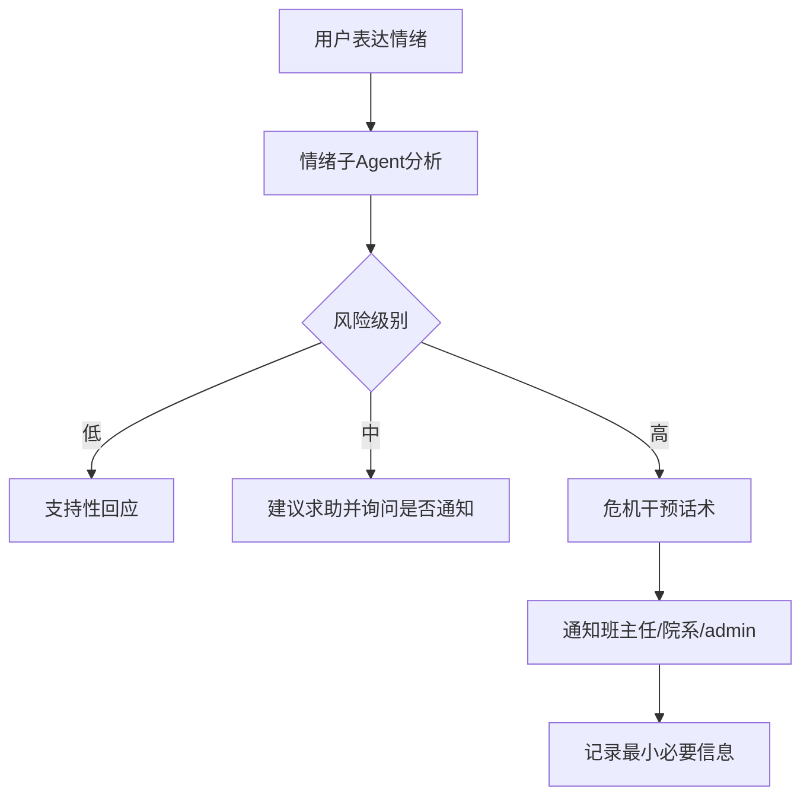

# 情绪风险人在回路

## 技术名称

情绪风险识别与人在回路通知

## 为什么需要它

情绪陪伴助手不能只聊天。当用户表达明显自伤、自杀、极端绝望等高风险信号时，系统需要引入现实中的人，例如班主任、辅导员、院系负责人或管理员。这体现了人在回路和安全兜底。

## 本项目中的应用

本项目在 `app/services/campus_agent/emotion_tools.py` 中处理情绪陪伴和风险识别，高风险场景会触发邮件通知链路。系统倾向让管理员收到重要风险信息，同时尽量减少邮件中的隐私暴露。

## 实现流程

## 核心实现

关键路径：

- `app/services/campus_agent/emotion_tools.py`
- `app/services/campus_agent/orchestrator.py`
- 邮件发送相关工具与用户档案关系。

核心原则：

- 低风险：陪伴、倾听、建议。
- 中风险：鼓励联系老师或心理中心。
- 高风险：明确建议立即联系现实支持，并触发必要通知。

## 最佳实践

- 不要做医学诊断。
- 高风险内容要优先安全，而不是追求“像真人聊天”。
- 邮件通知应最小化暴露，只说明风险等级和建议跟进。
- 学生未必愿意求助，但高危场景系统要有保护性机制。
- 要保留人工介入入口，AI 不能替代心理咨询师。

## 面试亮点

可以这样介绍：情绪模块不仅是聊天，还加入了风险分级和人在回路机制。低风险陪伴，高风险自动提醒相关负责人，兼顾用户体验和安全责任。

可能追问：这是否侵犯隐私？

回答：需要在隐私政策中告知高危例外，且通知内容只保留最小必要信息，目的是保护生命安全。

## 可以迁移到哪些项目

校园心理助手、员工关怀、客服风控、医疗预问诊、社区平台。

## 标签

#Safety #HumanInTheLoop #EmotionAI #风险控制
