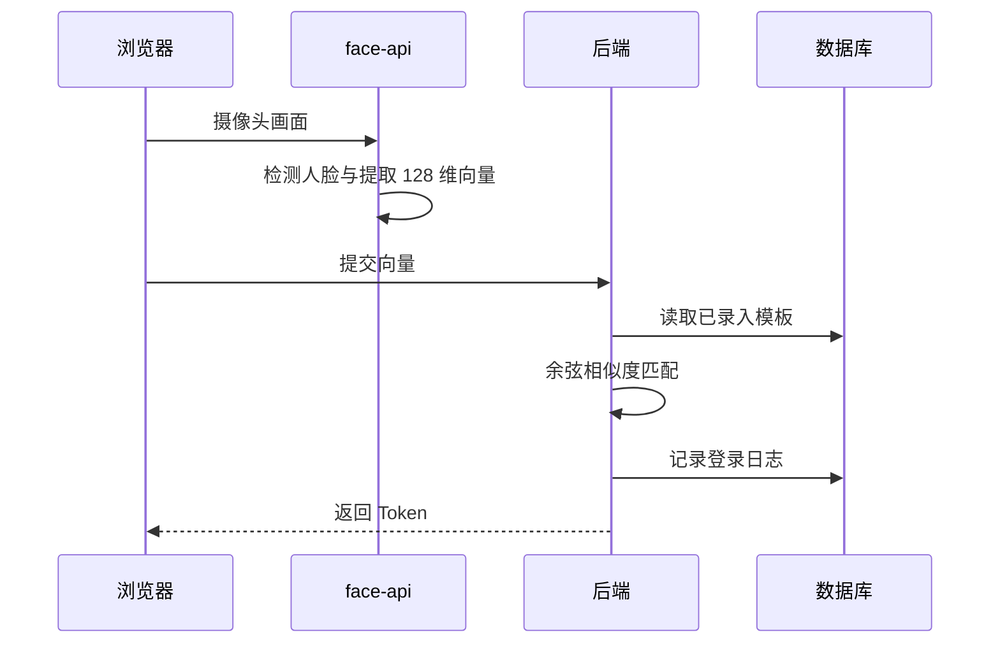

# 人脸识别登录

## 技术名称

浏览器端人脸特征提取与后端相似度登录

## 为什么需要它

人脸登录属于 AI 视觉能力，可以提升登录体验。关键不是保存照片，而是提取人脸特征向量，并在后端做相似度比对、风控和登录日志。

## 本项目中的应用

前端 `frontend/src/utils/faceDetection.ts` 使用 `@vladmandic/face-api` 加载检测、关键点和识别模型，提取 128 维人脸向量。后端 `app/services/face_service.py` 用余弦相似度和阈值 `0.6` 匹配用户，并记录登录日志。

## 实现流程



## 核心实现

关键路径：

- `frontend/src/utils/faceDetection.ts`
- `frontend/src/components/FaceLogin.vue`
- `frontend/src/components/FaceEnroll.vue`
- `app/services/face_service.py`
- `app/models/face.py`

核心算法：

```text
cosine_similarity = dot(a, b) / (norm(a) * norm(b))
```

## 最佳实践

- 后端保存特征向量，不保存原始人脸图片。
- 登录失败要限流，防止暴力尝试。
- 录入时要检查置信度和向量维度。
- 阈值需要通过测试调整，过高误拒，过低误认。
- 人脸登录应作为可选登录方式，不应替代密码恢复机制。

## 面试亮点

可以这样介绍：本项目人脸识别采用前端模型提取 128 维特征，后端通过余弦相似度匹配模板，并加入失败限流和登录日志。

可能追问：为什么不上传图片到后端识别？

回答：前端提取向量能减少隐私暴露和带宽，后端只保存特征向量，更适合轻量演示系统。

## 可以迁移到哪些项目

门禁系统、考勤系统、登录认证、考试监考、访客系统。

## 标签

#VisionAI #FaceRecognition #Authentication #CosineSimilarity
