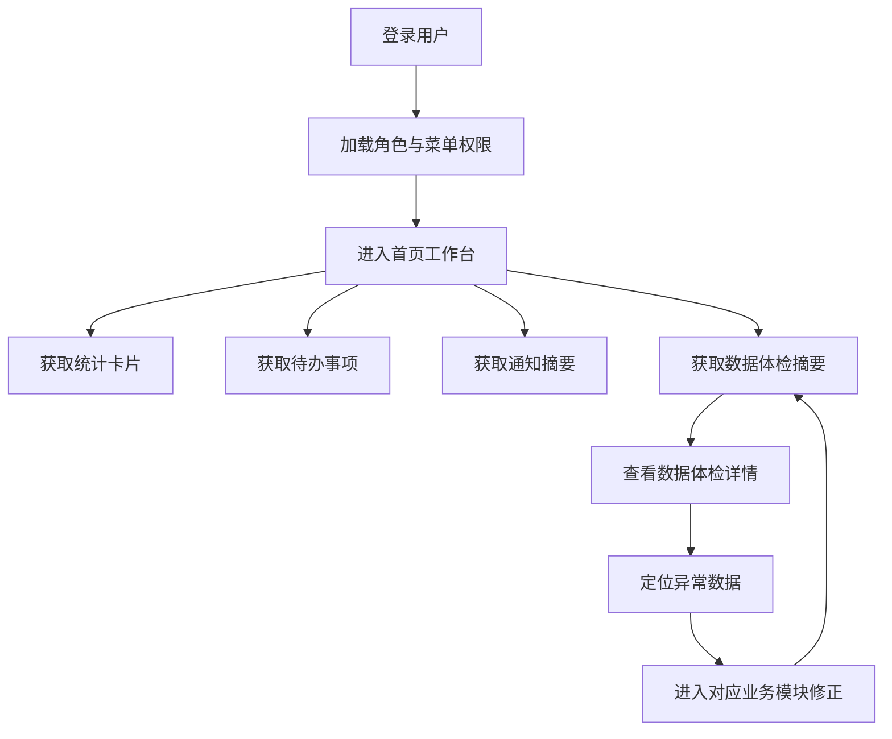
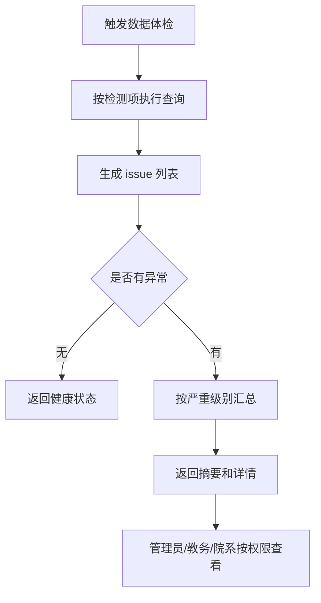
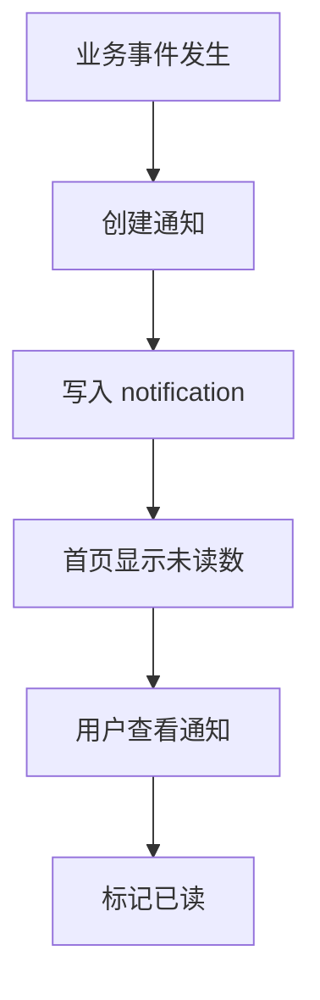
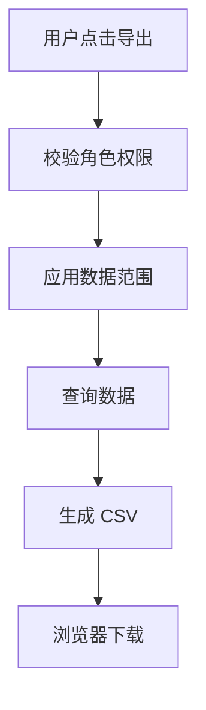

# 第一、第二阶段优化开发日志

## 目标范围

本轮只完成第一阶段和第二阶段，不开发第三阶段的大模块。

第一阶段目标：稳定现有系统，把已有模块串成业务闭环。

第二阶段目标：增强教务实用性，让系统具备可交付的日常办公能力。

## 当前模块基础

- 组织：院系、班级
- 人员：用户、角色、学生、教师
- 教学：课程、考试、成绩、学期、教室、课表
- 协同：请假、邮件、公告
- 辅助：Dashboard、AI 助手、RAG、自然语言查库

## 阶段一：稳定现有系统

### 1. 数据体检

新增“数据体检”能力，用于发现基础数据断链和异常数据。

首批检测项：

- 学生未关联班级
- 班级未关联院系
- 班级未配置班主任/辅导员
- 教师未关联用户
- 学生未关联用户
- 课程未设置任课教师
- 课程未设置开课院系
- 学生没有选课记录
- 课表缺少教室
- 课表教师时间冲突
- 课表班级时间冲突
- 课表教室时间冲突
- 考试未关联课程
- 考试未关联班级
- 成绩课程与考试课程不一致
- 已有考试但本班学生缺成绩
- 用户缺少邮箱
- 请假申请缺少组织归属

### 2. 权限范围基础规则

继续保留现有 RBAC 菜单权限，在业务查询中补充数据范围。

建议规则：

- `admin`：全校数据
- `academic_admin`：全校教务数据，原则上不管理系统角色
- `department_admin` / `staff_dean`：本院系数据
- `counselor` / `staff_counselor`：所带班级学生、请假、通知
- `teacher` / `staff_teacher`：本人授课课程、课表、考试和成绩
- `student`：本人数据

### 3. 首页待办工作台

Dashboard 不再只是统计卡片，改为按角色展示：

- 通用：未读邮件、公告、最近通知
- 学生：今日课表、我的请假状态、最近成绩
- 教师：今日课程、待录成绩、学生请假提醒
- 班主任/辅导员：待审请假、班级异常数据
- 院系主任：本院系异常数据、待审请假
- 管理员：全校数据体检摘要、系统统计

## 阶段二：增强教务实用性

### 1. 通知中心

新增通知中心基础能力，统一承接系统事件：

- 请假提交
- 请假审核通过/驳回
- 邮件收到
- 成绩发布
- 数据体检异常提醒

基础表：`notification`

建议字段：

- `id`
- `user_id`
- `title`
- `content`
- `category`
- `related_type`
- `related_id`
- `is_read`
- `read_at`
- `created_at`

### 2. 导入导出

优先做导出，导入后续细化模板校验。

首批导出：

- 学生列表 CSV
- 教师列表 CSV
- 课程列表 CSV
- 课表 CSV
- 成绩列表 CSV
- 单个学生成绩单 CSV

导入建议后续按模板逐个做：

- 学生批量导入
- 教师批量导入
- 课程批量导入
- 成绩批量导入

### 3. 成绩单与成绩发布

基础版先做学生成绩单接口：

- 管理员/教务可导出任意学生成绩单
- 学生只能导出自己的成绩单
- 教师可查看/导出本人授课课程相关成绩

## 总体流程图

## 数据体检流程

## 通知流程

## 导出流程

## 开发执行清单

- [x] 编写阶段一、二开发日志
- [x] 新增数据体检后端接口
- [x] 新增通知表、模型、服务、接口
- [x] Dashboard 接入工作台摘要
- [x] 新增导出接口
- [x] 新增学生成绩单接口
- [x] 新增前端页面/入口
- [x] 同步菜单与角色权限
- [x] 补充演示数据
- [x] 构建与接口验证

## 本轮完成记录

完成时间：2026-06-26

后端新增：

- `notification` 表、模型、迁移
- `/api/v1/operations/dashboard`
- `/api/v1/operations/data-health`
- `/api/v1/operations/exports/{export_type}`
- `/api/v1/notifications`
- `/api/v1/notifications/unread-count`
- `/api/v1/notifications/{id}/read`
- `/api/v1/notifications/read-all`

前端新增：

- 数据体检页面：`/operations/health`
- 数据导出页面：`/operations/export`
- 通知中心页面：`/notifications`
- Dashboard 工作台摘要、待办、数据健康、最近通知

同步脚本：

- `python -m scripts.sync_operations_module`

验证结果：

- Dashboard 接口返回 `200`
- 数据体检接口返回 `200`
- 通知列表接口返回 `200`
- 学生导出接口返回 `200`
- `npm run build` 通过

## 高危体检项修复记录

完成时间：2026-06-26

修复脚本：

- `python -m scripts.fix_high_risk_data`

处理内容：

- 重新排布全部有效课表的星期、节次、教室
- 保证同一学期内教师、班级、教室三类时间维度不冲突
- 保留原课程、班级、任课教师关系，仅调整时间和教室

修复结果：

- 高危项 `schedule_conflict` 从 `132` 降为 `0`
- 数据体检总异常数从 `139` 降为 `7`
- 剩余异常均非高危，后续按中危/低危继续处理

## 剩余体检项修复记录

完成时间：2026-06-26

修复脚本：

- `python -m scripts.fix_remaining_data_health`

处理内容：

- 补齐已有考试中缺失的学生成绩
- 为缺失成绩生成稳定演示分数与等级
- 重新计算相关考试的班级排名

修复结果：

- 中危项 `exam_missing_scores` 从 `7` 降为 `0`
- 新增缺失成绩记录 `42` 条
- 数据体检总异常数从 `7` 降为 `0`

## 验收标准

- Dashboard 能看到统计、待办、通知和数据健康摘要
- 数据体检能列出异常类型、数量和部分样例
- 通知中心能展示未读通知并标记已读
- 管理员可导出主要列表 CSV
- 学生可导出自己的成绩单
- 非管理员按角色范围看到合理数据
- 前端构建通过，主要页面无明显控制台错误
