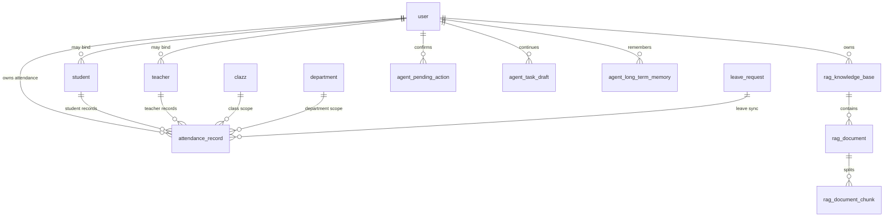

# 二阶段表设计文档：校园 AI 助手中心

版本：v1.0  
日期：2026-06-30  
状态：二阶段交付版

## 1. 设计原则

- 保持与现有 SQLAlchemy 模型风格一致。
- 业务数据和 AI 会话数据分离。
- 请假和考勤分表存储，但可通过 `leave_request_id` 联动。
- 所有用户相关数据尽量关联 `user.id`，同时保留 `student_id` / `teacher_id` 便于业务查询。
- 软删除字段沿用现有 `SoftDeleteMixin` 风格。

## 2. Agent 会话表：agent_session

用途：记录校园助手会话。

| 字段 | 类型 | 说明 |
| --- | --- | --- |
| id | int | 主键 |
| session_id | varchar(64) | 前端会话ID，唯一 |
| user_id | int | 用户ID，关联 user.id |
| title | varchar(100) | 会话标题 |
| mode | varchar(50) | 当前能力模式，如 auto / academic_tools |
| summary | text | 会话摘要 |
| last_message_at | datetime | 最后一条消息时间 |
| status | int | 1正常，0关闭 |
| created_at | datetime | 创建时间 |
| updated_at | datetime | 更新时间 |

## 3. Agent 消息表：agent_message

用途：记录对话消息。

| 字段 | 类型 | 说明 |
| --- | --- | --- |
| id | int | 主键 |
| session_id | varchar(64) | 会话ID |
| user_id | int | 用户ID |
| role | varchar(20) | user / assistant / system / tool |
| mode | varchar(50) | 消息所属模式 |
| content | text | 消息内容 |
| intent | varchar(100) | 识别出的意图 |
| metadata_json | json/text | 扩展信息 |
| created_at | datetime | 创建时间 |

## 4. 工具调用记录表：agent_tool_call

用途：记录 AI 调用系统工具的过程，方便审计和演示。

| 字段 | 类型 | 说明 |
| --- | --- | --- |
| id | int | 主键 |
| session_id | varchar(64) | 会话ID |
| message_id | int | 关联 agent_message.id |
| user_id | int | 用户ID |
| tool_name | varchar(100) | 工具名称 |
| tool_input | text | 工具入参，敏感信息需脱敏 |
| tool_output | text | 工具输出摘要 |
| status | varchar(20) | success / failed / denied |
| error_message | varchar(500) | 错误信息 |
| duration_ms | int | 执行耗时 |
| created_at | datetime | 创建时间 |

## 5. 用户反馈表：agent_feedback

用途：收集用户对回复的反馈。

| 字段 | 类型 | 说明 |
| --- | --- | --- |
| id | int | 主键 |
| session_id | varchar(64) | 会话ID |
| message_id | int | 被反馈的消息ID |
| user_id | int | 用户ID |
| rating | int | 1点赞，-1点踩 |
| comment | varchar(500) | 反馈说明 |
| created_at | datetime | 创建时间 |

## 6. 知识库文档表：agent_knowledge_doc

用途：管理 AI 知识问答、世界杯问答、校园制度问答等知识库文档。

| 字段 | 类型 | 说明 |
| --- | --- | --- |
| id | int | 主键 |
| category | varchar(50) | literature / ai / worldcup / policy |
| title | varchar(200) | 文档标题 |
| source_type | varchar(30) | markdown / pdf / manual / url |
| source_url | varchar(500) | 来源地址 |
| content_hash | varchar(64) | 内容哈希 |
| status | int | 1启用，0禁用 |
| created_by | int | 创建人 |
| created_at | datetime | 创建时间 |
| updated_at | datetime | 更新时间 |

说明：具体向量切片可复用现有 RAG 表或后续扩展 `agent_knowledge_chunk`。

## 7. 文档处理任务表：agent_file_task

用途：记录上传文档后的摘要、提纲、问答任务。

| 字段 | 类型 | 说明 |
| --- | --- | --- |
| id | int | 主键 |
| user_id | int | 上传用户 |
| file_name | varchar(255) | 文件名 |
| file_url | varchar(500) | 文件路径 |
| task_type | varchar(50) | summarize / outline / qa |
| status | varchar(20) | pending / processing / success / failed |
| result_text | text | 处理结果 |
| error_message | varchar(500) | 错误信息 |
| created_at | datetime | 创建时间 |
| updated_at | datetime | 更新时间 |

## 8. 考勤记录表：attendance_record

用途：记录学生和教职工的考勤结果。

建议新增独立考勤表，不建议把考勤塞进 `leave_request`。请假是申请审批流程，考勤是每日/每节/每次的出勤事实，两者生命周期不同。

| 字段 | 类型 | 说明 |
| --- | --- | --- |
| id | int | 主键 |
| person_type | varchar(20) | student / teacher |
| user_id | int | 用户ID |
| student_id | int nullable | 学生ID |
| teacher_id | int nullable | 教师ID |
| clazz_id | int nullable | 班级ID，学生考勤常用 |
| department_id | int nullable | 院系ID |
| attendance_date | date | 考勤日期 |
| period_type | varchar(30) | day / morning / afternoon / course / custom |
| course_schedule_id | int nullable | 关联课表，按课程考勤时使用 |
| checkin_time | datetime nullable | 签到时间 |
| checkout_time | datetime nullable | 签退时间 |
| status | varchar(30) | normal / late / early_leave / absent / leave / official / holiday / manual |
| source | varchar(30) | manual / leave_sync / import / system |
| leave_request_id | int nullable | 关联请假申请 |
| remark | varchar(500) | 备注 |
| created_by | int nullable | 创建人 |
| updated_by | int nullable | 更新人 |
| is_deleted | bool | 软删除 |
| deleted_at | datetime nullable | 删除时间 |
| created_at | datetime | 创建时间 |
| updated_at | datetime | 更新时间 |

索引建议：

- `(person_type, user_id, attendance_date)`
- `(student_id, attendance_date)`
- `(teacher_id, attendance_date)`
- `(clazz_id, attendance_date)`
- `(department_id, attendance_date)`
- `leave_request_id`

唯一约束建议：

- 第一版可设置 `(person_type, user_id, attendance_date, period_type, course_schedule_id)` 唯一，防止重复录入。
- 若 `course_schedule_id` 为空，MySQL 唯一约束对 NULL 的处理需谨慎，开发时可由服务层控制重复。

## 9. 考勤规则表：attendance_rule（可选）

第一版可以不做复杂规则，只做人工维护和请假联动。若后续要做自动判断迟到、早退，再增加规则表。

| 字段 | 类型 | 说明 |
| --- | --- | --- |
| id | int | 主键 |
| rule_name | varchar(100) | 规则名称 |
| person_type | varchar(20) | student / teacher |
| department_id | int nullable | 院系 |
| clazz_id | int nullable | 班级 |
| start_time | time | 应签到时间 |
| end_time | time | 应签退时间 |
| late_minutes | int | 迟到宽限分钟 |
| status | int | 启用状态 |

## 10. 与现有表关系

```text
user
  ├─ student
  │   └─ attendance_record
  ├─ teacher
  │   └─ attendance_record
  └─ agent_session
      └─ agent_message
          └─ agent_tool_call

leave_request
  └─ attendance_record.leave_request_id
```

## 11. 请假与考勤联动建议

- 请假审批通过后，可自动生成对应日期的考勤记录，状态为 `leave`。
- 请假撤销或驳回后，对应自动生成的考勤记录应同步取消或标记失效。
- 手工考勤记录优先级高于自动同步记录时，需要保留操作日志。
- 第一版可以先做“审批通过后生成考勤记录”，后续再做撤销同步和冲突处理。

## 12. 实际落地表清单

二阶段实际新增/强化的数据表如下：

| 表名 | 用途 |
| --- | --- |
| `attendance_record` | 学生/教职工考勤记录 |
| `agent_pending_action` | 助手待确认动作 |
| `agent_task_draft` | 助手多轮任务草稿 |
| `agent_long_term_memory` | 助手长期记忆 |
| `rag_knowledge_base` | 综合知识库 |
| `rag_document` | 知识库文档 |
| `rag_document_chunk` | 文档切片，和 Milvus 向量数据对应 |

说明：前文中的 `agent_session`、`agent_message`、`agent_tool_call` 属于完整审计设计，当前交付版优先落地了多轮任务、确认动作、长期记忆和 RAG 数据表。会话短期上下文由现有助手 memory 层维护，后续可继续扩展成完整消息表。

## 13. 待确认动作表：agent_pending_action

用途：保存新增、修改、删除、批量发邮件等需要用户二次确认的动作。用户回复“确认 43”后，系统根据该表恢复参数并执行。

| 字段 | 类型 | 说明 |
| --- | --- | --- |
| id | int | 主键，也是用户确认时看到的动作 ID |
| user_id | int | 发起用户 |
| session_id | varchar(64) | 会话 ID |
| tool_code | varchar(80) | 工具编码 |
| risk | varchar(20) | 风险等级 low / medium / high |
| status | varchar(20) | pending / executed / cancelled / expired / failed |
| args_json | text | 工具参数 JSON |
| summary | text | 给用户展示的确认摘要 |
| result_json | text | 执行结果 JSON |
| error_message | text | 执行失败原因 |
| expires_at | datetime | 过期时间 |
| executed_at | datetime | 执行时间 |
| created_at | datetime | 创建时间 |
| updated_at | datetime | 更新时间 |

索引建议：

- `user_id`
- `session_id`
- `tool_code`
- `status`

## 14. 任务草稿表：agent_task_draft

用途：解决自然语言多轮补参问题。例如用户先说“我想请假”，系统追问时间/类型/原因，用户下一轮补充后继续完成同一任务。

| 字段 | 类型 | 说明 |
| --- | --- | --- |
| id | int | 主键 |
| user_id | int | 用户 ID |
| session_id | varchar(64) | 会话 ID |
| module_code | varchar(50) | 能力模块 |
| mode | varchar(50) | 当前助手模式 |
| tool_code | varchar(80) | 目标工具 |
| status | varchar(20) | active / completed / cancelled / expired |
| args_json | text | 已收集参数 |
| missing_fields_json | text | 缺失字段 |
| candidates_json | text | 候选对象，如同名学生/教师 |
| message | text | 最近追问提示 |
| expires_at | datetime | 草稿过期时间 |
| created_at | datetime | 创建时间 |
| updated_at | datetime | 更新时间 |

设计原则：

- 草稿只保存“未完成任务”，不是执行凭证。
- 从草稿恢复后仍必须重新走工具白名单、权限校验和数据范围校验。
- 写操作仍必须生成 `agent_pending_action`。

## 15. 长期记忆表：agent_long_term_memory

用途：保存跨会话可复用的信息，如用户偏好、常用任务、学习目标、历史摘要等，为后续更多模块共用。

| 字段 | 类型 | 说明 |
| --- | --- | --- |
| id | int | 主键 |
| user_id | int | 用户 ID |
| module_code | varchar(50) | 来源模块 |
| memory_type | varchar(50) | event / preference / profile / summary 等 |
| content | text | 记忆内容 |
| payload_json | text | 结构化扩展数据 |
| importance | smallint | 重要程度 1-5 |
| status | varchar(20) | active / archived |
| last_used_at | datetime | 最近召回时间 |
| created_at | datetime | 创建时间 |
| updated_at | datetime | 更新时间 |

后续扩展：

- 可将高价值长期记忆同步到 Milvus，做语义召回。
- 情绪陪伴、学习辅导、RAG、数据分析都可共用该表。

## 16. 综合知识库表：rag_knowledge_base

用途：保存用户创建的综合知识库元数据。

| 字段 | 类型 | 说明 |
| --- | --- | --- |
| id | int | 主键 |
| name | varchar(100) | 知识库名称 |
| description | varchar(512) | 描述 |
| owner_id | int | 所有人，关联 `user.id` |
| scope_type | varchar(20) | personal / public / class / course |
| scope_id | int nullable | 范围 ID |
| status | smallint | 1启用，0禁用 |
| document_count | int | 文档数量 |
| chunk_count | int | 切片数量 |
| is_deleted | bool | 软删除 |
| deleted_at | datetime | 删除时间 |
| created_at | datetime | 创建时间 |
| updated_at | datetime | 更新时间 |

索引：

- `(owner_id, scope_type, scope_id)`

## 17. 知识库文档表：rag_document

用途：记录导入知识库的文档。

| 字段 | 类型 | 说明 |
| --- | --- | --- |
| id | int | 主键 |
| kb_id | int | 知识库 ID |
| owner_id | int | 所有人 |
| title | varchar(200) | 文档标题 |
| source_type | varchar(20) | text / upload / path |
| file_name | varchar(255) | 原文件名 |
| file_path | varchar(500) | 文件路径 |
| file_ext | varchar(20) | 文件扩展名 |
| file_hash | varchar(64) | 文件哈希 |
| status | varchar(20) | pending / processing / completed / failed / deleted |
| error_message | text | 错误信息 |
| chunk_count | int | 切片数量 |
| char_count | int | 字符数 |
| is_deleted | bool | 软删除 |
| deleted_at | datetime | 删除时间 |
| created_at | datetime | 创建时间 |
| updated_at | datetime | 更新时间 |

索引：

- `(kb_id, status)`
- `(owner_id, status)`
- `file_hash`

## 18. 文档切片表：rag_document_chunk

用途：保存切片文本。向量数据同步到 Milvus，MySQL 保留原文和元数据。

| 字段 | 类型 | 说明 |
| --- | --- | --- |
| id | int | 主键 |
| kb_id | int | 知识库 ID |
| document_id | int | 文档 ID |
| owner_id | int | 所有人 |
| chunk_no | int | 切片序号 |
| content | text | 切片内容 |
| content_hash | varchar(64) | 内容哈希 |
| char_count | int | 字符数 |
| token_count | int | 估算 token 数 |
| status | varchar(20) | completed / deleted |
| is_deleted | bool | 软删除 |
| deleted_at | datetime | 删除时间 |
| created_at | datetime | 创建时间 |
| updated_at | datetime | 更新时间 |

索引：

- `(kb_id, document_id)`
- `(document_id, chunk_no)`
- `content_hash`

## 19. 最终表关系图



## 20. 数据范围与权限关系

| 角色 | 数据范围 |
| --- | --- |
| 学生 | 自己的成绩、课表、请假、考勤、知识库 |
| 教师 | 自己授课和管理范围内的数据 |
| 班主任 | 本班学生、考勤、请假 |
| 院系主任 | 本院系学生、教师、课程、考勤 |
| 管理员 | 全局数据 |

所有自然语言操作最终仍落到后端 service 层和权限校验，不允许大模型绕过表关系直接写库。
